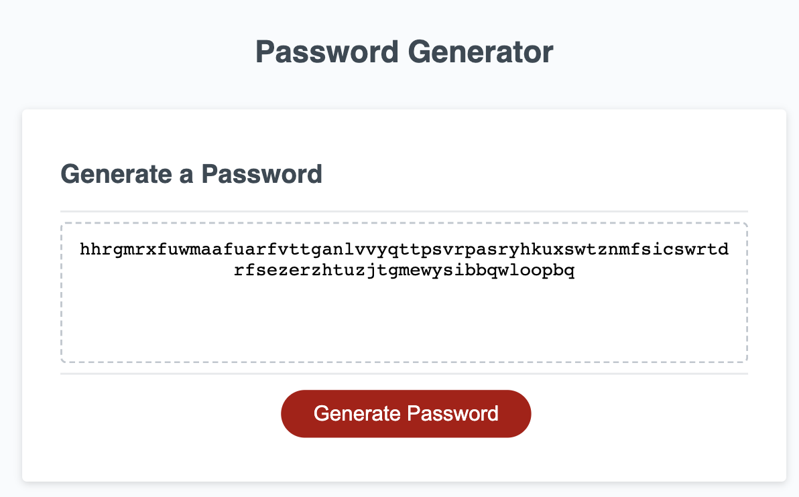

# password-gen
This application allows a user to generate a random password based on criteria they've selected.

# Deployed App
Link to Deployed Application created with React


Link to Deployed Application created without React
https://tasshroll.github.io/passworddds/

Screenshot of application creating a password of length 90 characters with only lowercase letters.




## Description

This Application will generate a random password based on user criteria selected. The random password is displayed in the text area. 
Character strings will build a valid character set based on user input. Users are asked what password length they desire. Password length must be between 8 and 128 characters long. Users are asked what type of characters to include. 
Character Choices are :

* `lowercase a-z`, 

* `uppercase A-Z`, 

* `numbers 0-9`

* `special characters "!\"#$%&'()*+,-./:;<=>?@[\\]^_`{|}~"` 


This project was created with create-react-app. React is a front-end library developed by Facebook. It's used for building interactive user interfaces efficiently with significantly less code that with vanilla JavaScript. The Password component is the interface to the applications entire user interface.


## Installation

To run, use the deployed link at:

Or on command line of visual studio, type
```
    npm run start
```

This will prompt you to view react-passwords in the browser at localhost:3000
    
## User Story

```
AS AN employee with access to sensitive data
I WANT to randomly generate a password that meets certain criteria
SO THAT I can create a strong password that provides greater security
```

## Acceptance Criteria

```
GIVEN I need a new, secure password
WHEN I click the button to generate a password
THEN I am presented with a series of prompts for password criteria
WHEN prompted for password criteria
THEN I select which criteria to include in the password
WHEN prompted for the length of the password
THEN I choose a length of at least 8 characters and no more than 128 characters
WHEN asked for character types to include in the password
THEN I confirm whether or not to include lowercase, uppercase, numeric, and/or special characters
WHEN I answer each prompt
THEN my input should be validated and at least one character type should be selected
WHEN all prompts are answered
THEN a password is generated that matches the selected criteria
WHEN the password is generated
THEN the password is either displayed in an alert or written to the page
```


